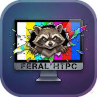

#  Feral HTPC 
### *** Official Notice: ***
#### Feral HTPC is not affiliated with *Fancy Bits, LLC* or *Channels DVR* and it is <ins>NOT</ins> an official Channels client.

Welcome to the Feral HTPC project. This application is a native Windows client designed to interface with your Channels DVR server.

### Alpha Release Notice

Please note that this is currently an alpha release. There will be bugs and issues. While I am actively working on improvements and fixes, please do not expect all features to function perfectly or for the application to be feature-rich during this alpha release cycle.

### Downloading and Installing

1. Navigate to the **Releases** section on the right side of this GitHub repository page.
2. Download the latest `.exe` installer file.
3. Locate the downloaded file on your computer and double-click to run it.
4. **Important:** Because this is an early unsigned release, Windows Defender SmartScreen will likely display a blue warning screen preventing it from starting. To bypass this, click the **More info** link on that screen, and then click the **Run anyway** button that appears. Follow the standard installation prompts from there.

### Keyboard Controls

The HTPC application is designed to be fully navigable via a keyboard or a media center remote that maps to standard keyboard keys.

During video playback, the following keys are available:

* **Up Arrow:** Channel Up (Live TV only)
* **Down Arrow:** Channel Down (Live TV only)
* **Left Arrow:** Rewind 10 seconds (or hold to scrub back)
* **Right Arrow:** Fast Forward 30 seconds (or hold to scrub forward)
* **Spacebar / Enter:** Play / Pause
* **F / F11:** Toggle Fullscreen mode
* **C:** Toggle Closed Captions / Subtitles
* **Escape / Backspace:** Exit Fullscreen (if active), or Close the player and return to the menu
* **Media Play/Pause Key:** Play / Pause
* **Media Stop Key:** Stop playback and return to the menu
* **Volume Up / Down Keys:** Adjust application volume
* **Mute Key:** Toggle volume mute

### Mobile Remote App

This application features a built-in companion web server that acts as a mobile remote control. When the HTPC app is running, it hosts a local web interface that you can access from any smartphone, tablet, or secondary computer on your home network.

You can find the exact URL to type into your mobile browser by navigating to the **Settings** page within the Channels HTPC Windows app.

From the mobile remote interface, you can:

* Browse the live TV guide and your saved channel collections.
* Browse your recorded Movies and TV Shows.
* Launch media directly onto the TV screen.
* Control playback (Play, Pause, Fast Forward, Rewind, Scrubbing).
* Manage volume, closed captions, and picture-in-picture modes.
* Simulate physical mouse and keyboard inputs to navigate the Windows application natively from your phone.
